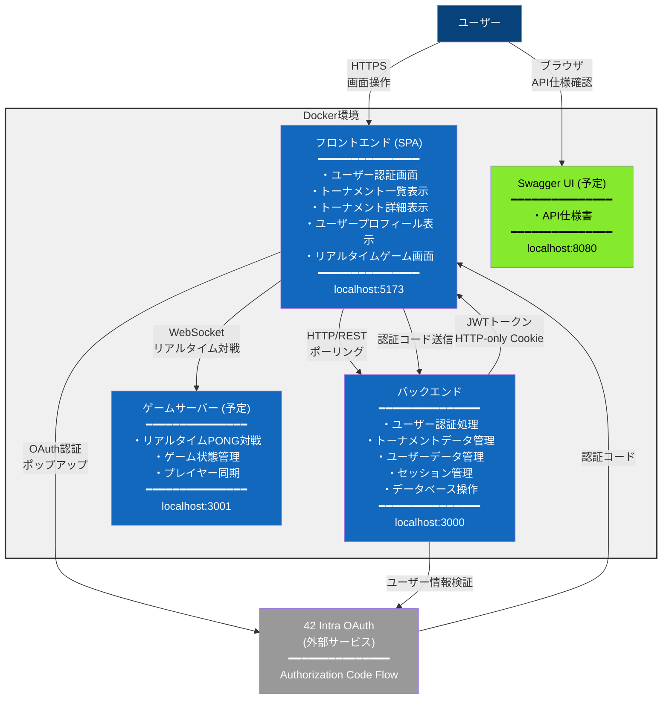

## コンテナ構成図

---

## 技術スタック

| 項目                       | **フロントエンド**                            | **バックエンド**                                            | **ゲームサーバー（予定）** | **Swagger UI（予定）** |
| -------------------------- | --------------------------------------------- | ----------------------------------------------------------- | -------------------------- | ---------------------- |
| **言語**                   | TypeScript 5.8.3                              | TypeScript 5.9.2                                            | TypeScript 5.9.2           | -                      |
| **フレームワーク**         | なし（バニラTS）                              | Fastify 5.6.1                                               | Fastify 5.6.1              | -                      |
| **通信方式**               | HTTP/REST                                     | HTTP/REST                                                   | WebSocket                  | HTTP                   |
| **認証方式**               | 42 OAuth 2.0 / Mock                           | JWT (HTTP-only Cookie)                                      | -                          | -                      |
| **開発ツール**             | Vite 7.1.7                                    | tsx 4.20.5                                                  | tsx                        | -                      |
| **ビルドツール**           | Vite (tsc + esbuild)                          | tsc                                                         | tsc                        | -                      |
| **実行環境**               | ブラウザ                                      | Node.js 22                                                  | Node.js 22                 | ブラウザ               |
| **TSコンパイルターゲット** | ES2022                                        | ES2023                                                      | ES2023                     | -                      |
| **モジュールシステム**     | ESNext (bundler)                              | NodeNext                                                    | NodeNext                   | -                      |
| **開発コマンド**           | `pnpm dev`                                    | `pnpm dev`                                                  | `pnpm dev`                 | -                      |
| **ビルドコマンド**         | `pnpm build`                                  | `pnpm build`                                                | `pnpm build`               | -                      |
| **出力先**                 | `dist/` (最適化・minify済み)                  | `dist/` (JavaScriptのみ)                                    | `dist/` (JavaScriptのみ)   | -                      |
| **開発サーバー**           | localhost:5173                                | localhost:3000                                              | localhost:3001             | localhost:8080         |
| **主な機能**               | UI表示・操作                                  | 認証・DB・API                                               | リアルタイムゲーム         | API仕様書・テスト      |
| **スタイリング**           | Tailwind CSS 4.1.13                           | -                                                           | -                          | -                      |
| **バリデーション**         | -                                             | Typebox (@fastify/type-provider-typebox 6.0.0) + Zod 4.1.11 | Zod                        | -                      |
| **データベース**           | -                                             | SQLite 3 (sqlite 5.1.1 + sqlite3 5.1.7)                     | -                          | -                      |
| **認証ライブラリ**         | -                                             | jsonwebtoken 9.0.2 + @fastify/cookie 11.0.2                 | -                          | -                      |
| **WebSocketライブラリ**    | -                                             | -                                                           | @fastify/websocket         | -                      |
| **Dockerイメージ**         | node:22-slim (build) + nginx:alpine (runtime) | node:22-slim                                                | node:22-slim               | swaggerapi/swagger-ui  |

---
