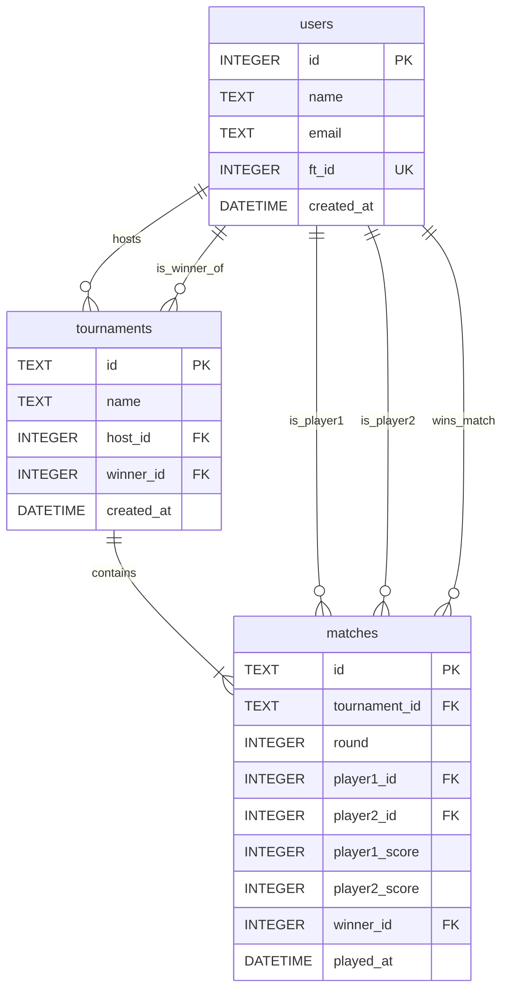

```mermaid
erDiagram
    users {
        INTEGER id PK
        TEXT name
        TEXT email
        INTEGER ft_id UK
        DATETIME created_at
    }

    tournaments {
        TEXT id PK
        TEXT name
        INTEGER host_id FK
        INTEGER winner_id FK
        DATETIME created_at
    }

    matches {
        TEXT id PK
        TEXT tournament_id FK
        INTEGER round
        INTEGER player1_id FK
        INTEGER player2_id FK
        INTEGER player1_score
        INTEGER player2_score
        INTEGER winner_id FK
        DATETIME played_at
    }

    users ||--o{ tournaments : "hosts"
    users ||--o{ tournaments : "is_winner_of"
    tournaments ||--|{ matches : "contains"
    users ||--o{ matches : "is_player1"
    users ||--o{ matches : "is_player2"
    users ||--o{ matches : "wins_match"
```
